## Escuela Colombiana de Ingeniería

### Ciclos de vida del desarrollo software

### Desarrollo Dirigido por Pruebas + DIP + DI + Contenedores Livianos

### Lab 4

### Parte I
   
- A partir del código existente, implemente sólo los cascarones del
   modelo antes indicado. Haga la especificación de los métodos calculateScore (de las tres
   variantes de GameScore), a partir de las especificaciones
   generales dadas anteriormente. Recuerde tener en cuenta: @pre,
   @pos, @param, @throws.

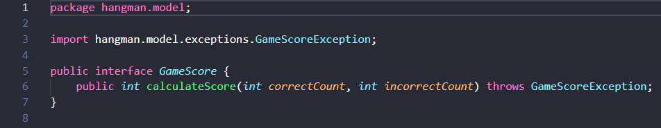
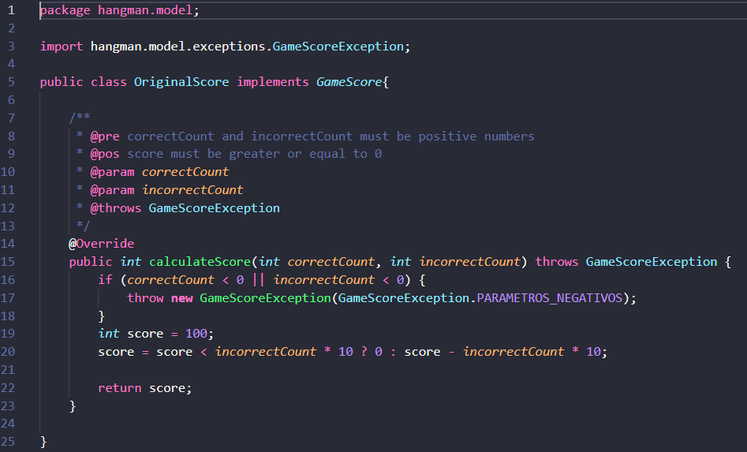
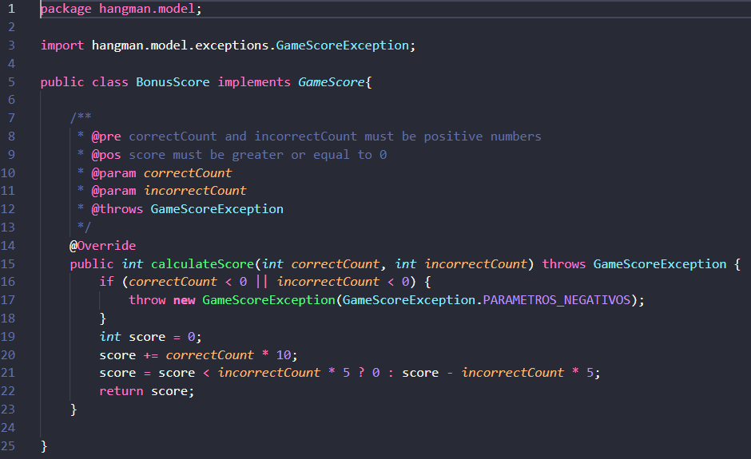
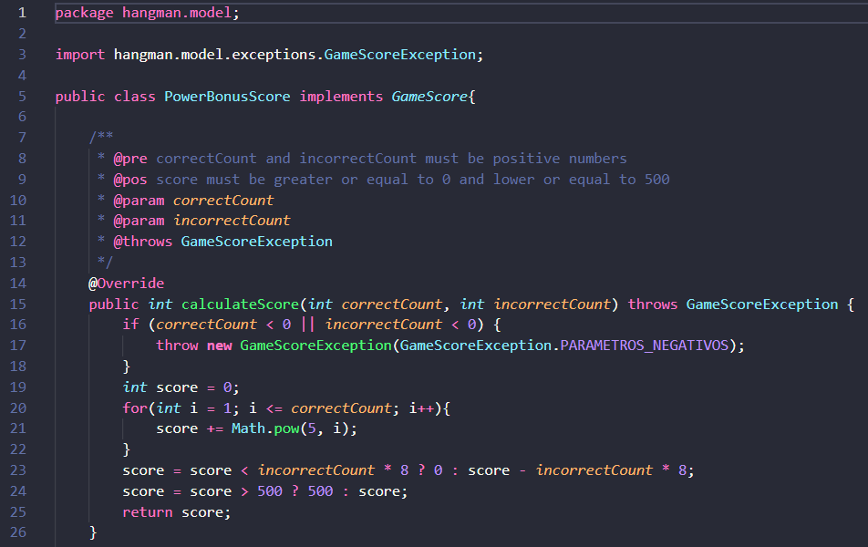

- Actualice el archivo `pom.xml` e incluya las dependencias para la ultima versión de JUnit y la versión del compilador de Java a la versión 8.

    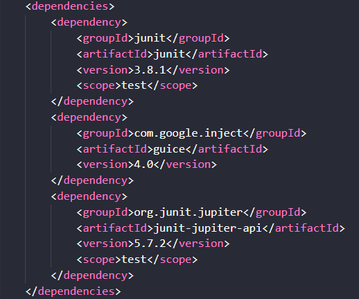   

- Teniendo en cuenta dichas especificaciones, en la clase donde se
   implementarán las pruebas (GameScoreTest), en los
   comentarios iniciales, especifique las clases de equivalencia para
   las tres variantes de GameScore, e identifique
   condiciones de frontera. 

    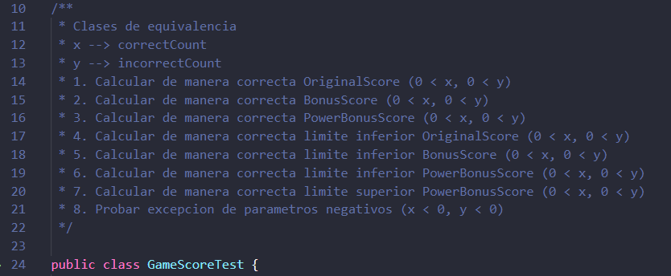   

- Para cada clase de equivalencia y condición de frontera, implemente
   una prueba utilizando JUnit.

    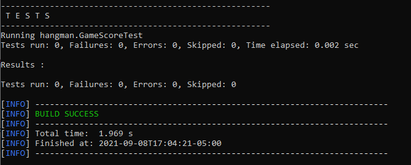   

### Parte II

- Utilizando el HangmanFactoryMethod (MétodoFabrica) incluya el
   OriginalScore a la configuración.

    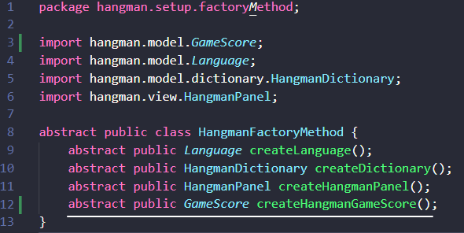 
   
    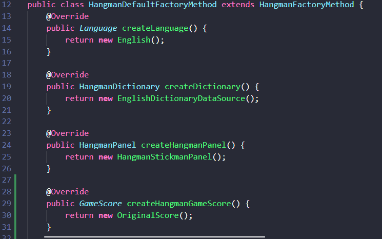   

    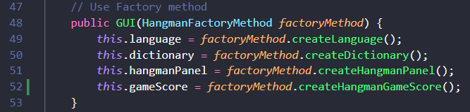       

Incorpore el Contenedor Liviano Guice dentro del proyecto:

* Revise las dependencias necesarias en el pom.xml.

    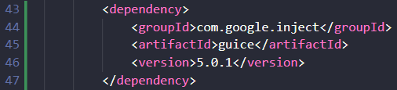   

* Modifique la inyección de dependencias utilizando guice en lugar del
  método fábrica.

    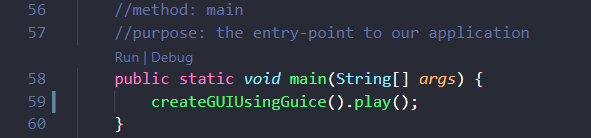   

* Configure la aplicación de manera que desde el programa SwingProject
  NO SE CONSTRUYA el Score directamente, sino a través de Guice, asi
  mismo como las otras dependencias que se están inyectando mediante
  la fabrica.
* Mediante la configuración de la Inyección de
  Dependencias se pueda cambiar el comportamiento del mismo, por
  ejemplo:
	* Utilizar el esquema OriginalScore.
	* Utilizar el esquema BonusScore.
	* Utilizar el idioma francés.
    * Utilizar el diccionario francés.
	* etc...
